# Top 25 Best Home Improvement Tools in 2025 (Latest Updated)

Tackling a home project can be incredibly satisfying, but hitting a wall because you don’t have the right equipment is a familiar frustration for many DIYers and even professionals. The challenge isn't just finding a tool; it's finding the right platform that offers a good balance of quality, price, and selection. This guide cuts through the online clutter to bring you the best websites for home improvement tools, ensuring you get reliable gear for any job, big or small.

## **[VEVOR](https://www.vevor.com)**
VEVOR is a go-to online retailer for a massive range of affordable tools and equipment, catering to both DIY enthusiasts and budget-conscious professionals looking for specialized gear.

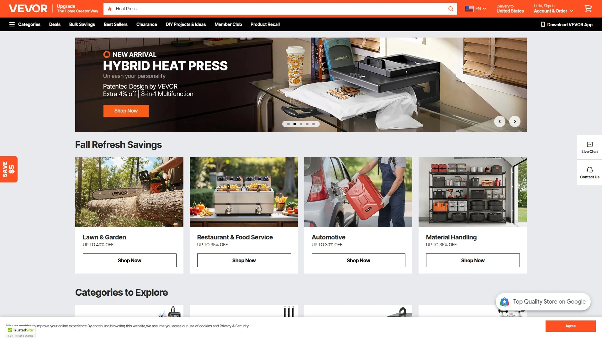

- **Core Strengths:** VEVOR's main draw is its vast and diverse catalog, which spans everything from automotive and construction tools to kitchen supplies and garden equipment. They specialize in providing tough, functional equipment at surprisingly low prices.
- **User Profile:** It's an ideal platform for hobbyists who need a specific tool for a single project or small business owners who want to expand their capabilities without a huge upfront investment.
- **Why It Stands Out:** While some brands focus on a narrow niche, VEVOR covers an enormous spectrum. You can find anything from a diesel heater to a soft-serve ice cream machine, often for a fraction of the cost of mainstream brands.

## **[The Home Depot](https://www.homedepot.com)**
A titan in the home improvement space, The Home Depot's website functions as a massive digital warehouse supported by its extensive network of physical stores.

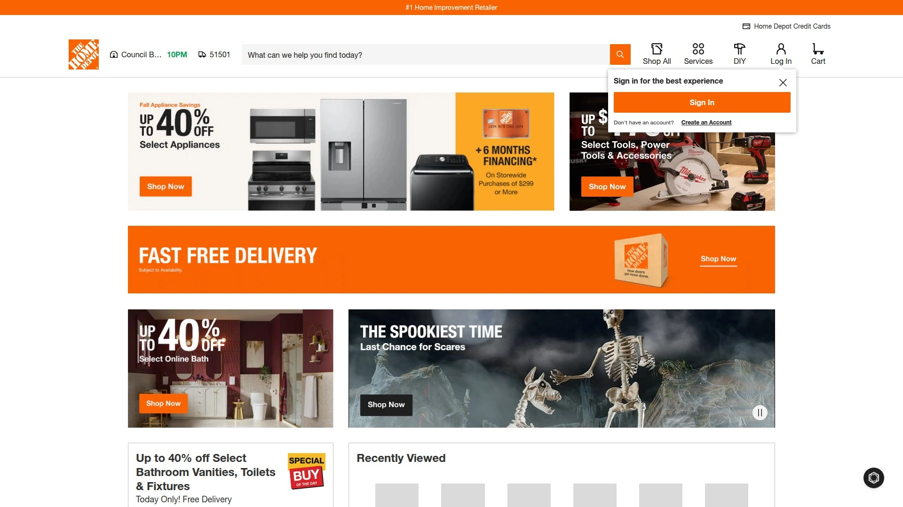

- **Key Features:** Its robust site offers millions of products with real-time local store inventory, buy-online-pickup-in-store options, and even an in-app product locator to guide you down the right aisle.
- **Applicable Scenarios:** Perfect for both pros and DIYers who need tools, materials, and supplies immediately. Their rental service for heavy-duty equipment is also a major advantage for one-off projects.

## **[Lowe's](https://www.lowes.com)**
Lowe's provides a comprehensive online shopping experience that rivals The Home Depot, with a clean interface and strong features for both DIY customers and professionals.

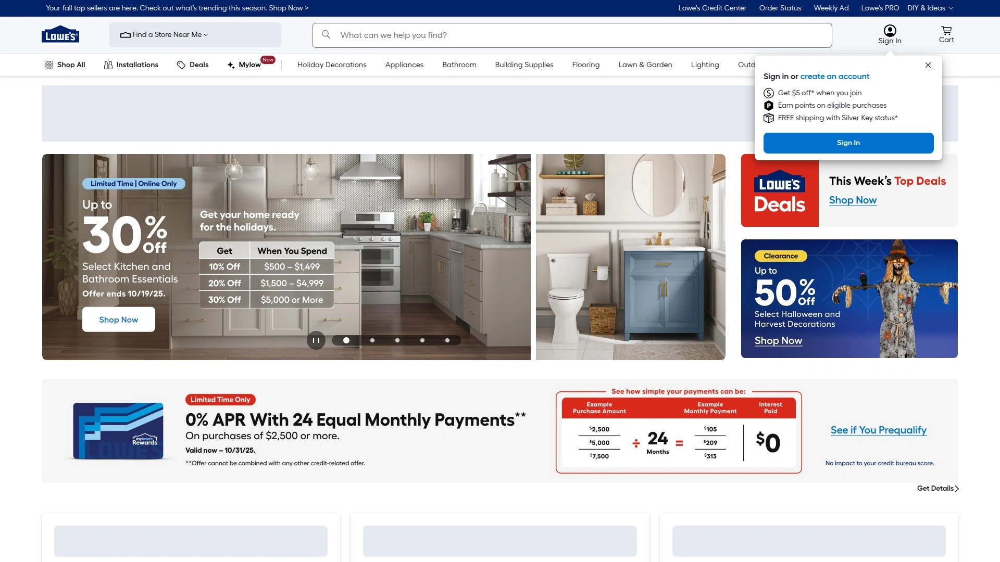

- **Differentiating Points:** Lowe's is known for its strong selection of home appliances, garden supplies, and a wide array of major tool brands. Its website often features helpful project guides and calculators to assist with planning.
- **User Experience:** The platform offers an AR "View in Your Space" feature for certain products, allowing you to visualize items in your home before purchasing.

## **[Acme Tools](https://www.acmetools.com)**
Acme Tools is a premier online retailer for serious tool enthusiasts and trade professionals, offering a vast selection from top-tier brands like Milwaukee, DeWalt, and Makita.

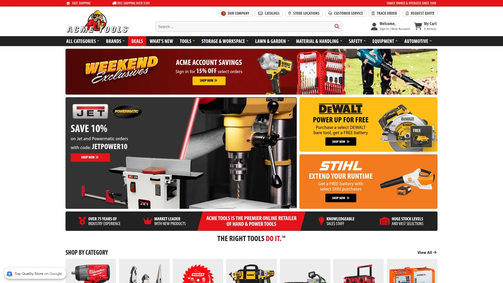

- **Core Focus:** Unlike big-box stores, Acme's primary focus is on tools and equipment. This specialization means they often have a wider selection of professional-grade items and accessories.
- **Recommendation Reason:** If you're loyal to a specific brand or need a highly specialized power tool, Acme is one of the best places to look. They also offer competitive combo kits and reconditioned tools for better value.

## **[Bob Vila](https://www.bobvila.com)**
More than just a store, Bob Vila's website is a trusted resource for home improvement advice, project tutorials, and unbiased product reviews that has been guiding homeowners for decades.

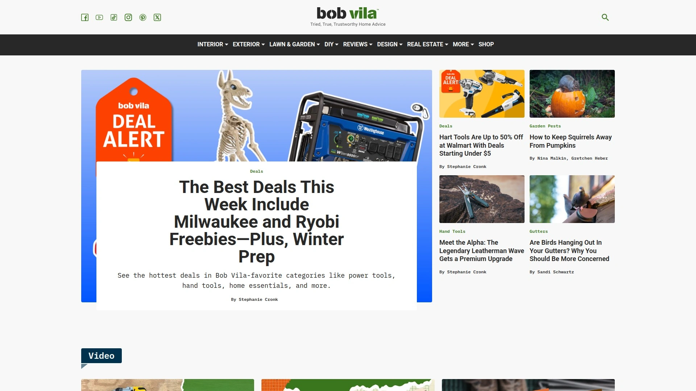

- **Value Proposition:** While you don't buy directly from the site, it serves as an invaluable research hub. Its writers test and review tools, providing practical insights and recommendations that help you make informed purchasing decisions.
- **How to Use It:** Use it to research your next tool purchase, learn a new DIY skill, or find solutions to common household problems before heading to a retail site.

## **[DeWalt](https://www.dewalt.com)**
The official DeWalt site is the definitive source for anyone invested in its ecosystem of "Guaranteed Tough" yellow and black tools.

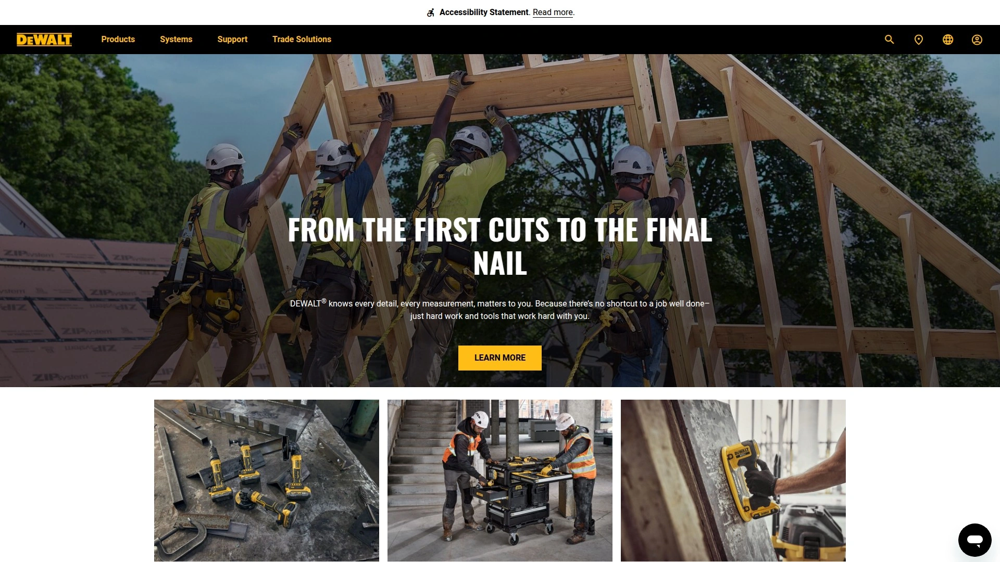

- **Main Function:** It's the best place to explore the entire DeWalt product line, including their expansive 20V MAX and FLEXVOLT systems. You can register products, find service centers, and get detailed specifications.
- **Target Audience:** Ideal for professional contractors, woodworkers, and serious DIYers who rely on the durability and performance of DeWalt tools.

## **[Milwaukee Tool](https://www.milwaukeetool.com)**
Milwaukee's official website is dedicated to its extensive range of "HEAVY DUTY" red tools, particularly popular among electricians, plumbers, and automotive mechanics.

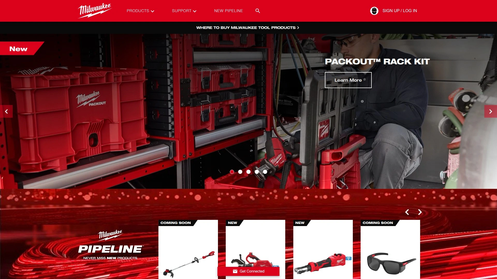

- **Key Offerings:** The site is a deep dive into their innovative M12, M18, and MX FUEL cordless systems. It also showcases their PACKOUT modular storage system, which is a major draw for professionals.
- **Why Visit:** It's essential for anyone committed to the Milwaukee platform, offering detailed product info and a look at upcoming innovations.

## **[Houzz](https://www.houzz.com)**
Houzz is an all-in-one platform for home remodeling and design, blending inspiration, product discovery, and a directory of local professionals.

- **Unique Blend:** You can browse millions of high-resolution project photos, use an AR tool to see furniture in your room, and purchase products directly from the platform. It's a visual-first approach to home improvement.
- **Applicable Scenarios:** Perfect for homeowners in the planning stages of a remodel who want to define their style and find both the products and the people to bring it to life.

## **[Direct Tools Factory Outlet](https://www.directtoolsoutlet.com)**
The official online outlet for brands like Ryobi, RIDGID, and Hoover, offering new, blemished, and reconditioned products at a significant discount.

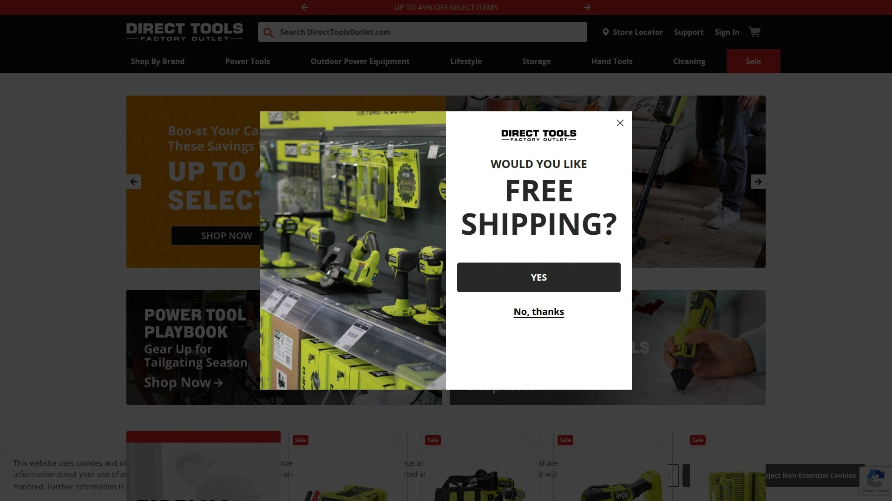

- **Value Proposition:** This is where you can find some of the best deals on power tools, especially if you're a DIYer or homeowner who doesn't need the latest model. The savings on reconditioned items can be substantial.
- **Best For:** Budget-conscious builders and anyone looking to expand their Ryobi ONE+ collection without paying full price.

## **[Angi](https://www.angi.com)**
Formerly Angie's List, Angi is a leading website for finding and hiring local home service professionals, from plumbers and electricians to painters and remodelers.

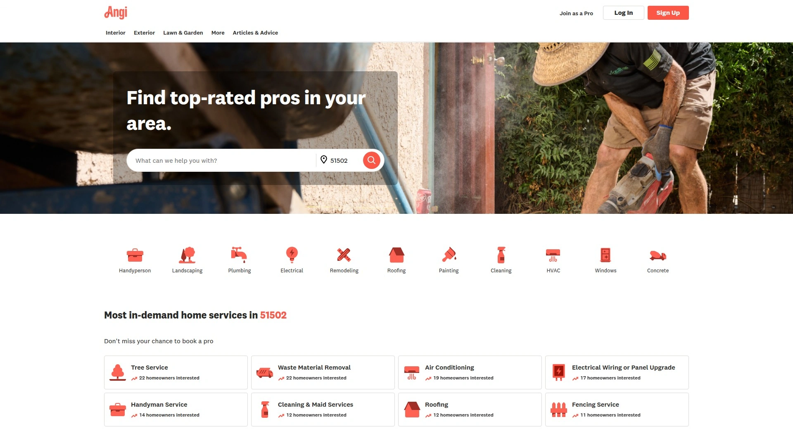

- **Core Service:** While not a tool retailer, it's a critical tool for any homeowner who decides a project is too big to DIY. You can read reviews, request quotes, and book vetted pros.
- **When to Use:** When you need a skilled tradesperson, Angi helps you find reliable help and manage the hiring process.

## **[This Old House](https://www.thisoldhouse.com)**
Similar to Bob Vila, This Old House is a legendary brand in home improvement that offers expert advice, step-by-step project guides, and trusted product reviews.

- **Educational Value:** The website is a treasure trove of practical knowledge, breaking down complex projects into manageable steps. Their team of experts provides insights you won't find on a simple retail page.
- **Recommendation Reason:** A must-visit for research and education. Their detailed reviews can help you choose the right tool for the job based on real-world testing.

## **[Thumbtack](https://www.thumbtack.com)**
Thumbtack is a modern platform for instantly finding and hiring local professionals for virtually any home project, making it easy to get cost estimates and compare options.

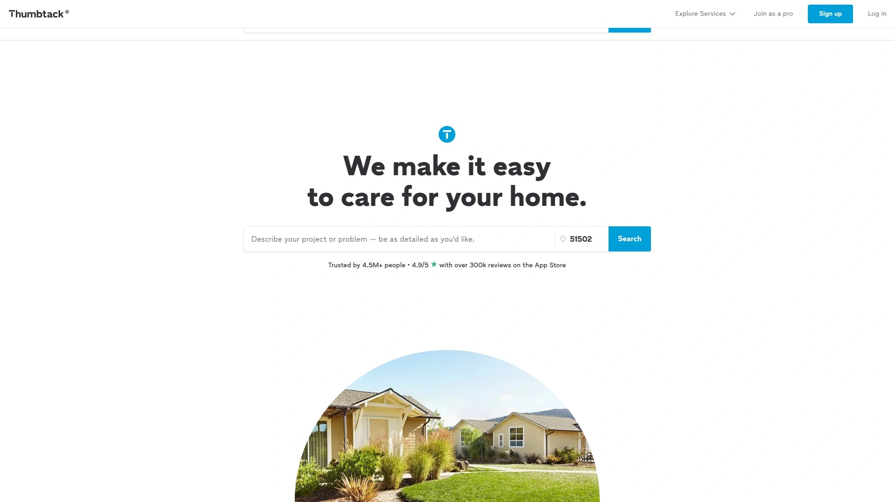

- **How It Works:** You describe your project, and the platform connects you with available pros in your area. It streamlines the process of getting multiple quotes.
- **Target User:** Homeowners who need to quickly find skilled labor for repairs, installations, or larger renovation projects.

## **[Worx](https://www.worx.com)**
Worx is known for its innovative and user-friendly tools for lawn, garden, and DIY tasks, often featuring clever designs that simplify common jobs.

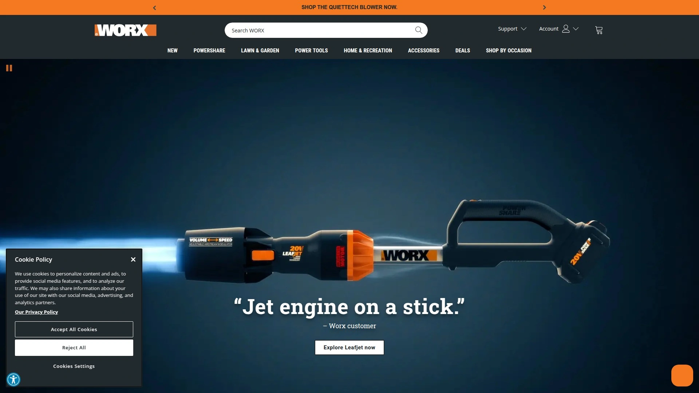

- **Signature Products:** Famous for the JawHorse, a versatile clamping workstation, and the Switchdriver, a drill with a rotating dual chuck. Their tools are often lightweight and designed for homeowner convenience.
- **Best For:** Light to moderate DIY tasks and yard work. It's a great brand for those who value clever features and ease of use over raw power.

## **[Stanley Tools](https://www.stanleytools.com)**
A classic American brand, Stanley has been making reliable hand tools for over a century. Their website showcases their full range, from iconic tape measures and utility knives to their more durable FATMAX line.

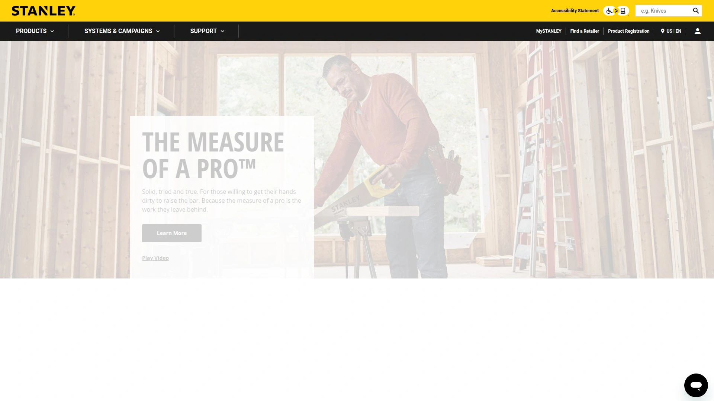

- **Core Strength:** Stanley is synonymous with dependable and accessible hand tools. It’s a foundational brand for any new homeowner or aspiring DIYer.
- **Product Range:** While best known for hand tools, they also offer mechanics' tool sets, storage solutions, and more.

## **[Ryobi Tools](https://www.ryobitools.com)**
Ryobi is a DIY favorite, known for its massive and affordable 18V ONE+ system, where a single battery type powers hundreds of different tools and lifestyle products.

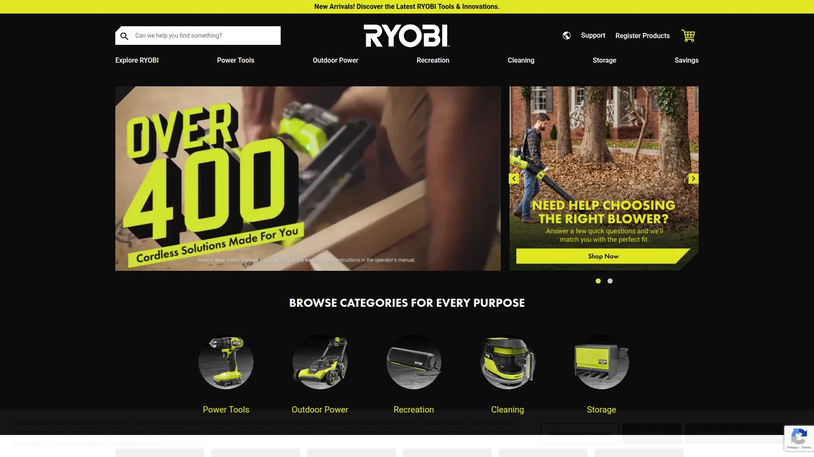

- **Value Proposition:** The brand offers an unbeatable combination of variety and value. You can power everything from a drill to a leaf blower to a camping fan with the same battery.
- **Target Audience:** The quintessential brand for homeowners and DIY enthusiasts who want a versatile and budget-friendly cordless system.

## **[Harbor Freight Tools](https://www.harborfreight.com)**
Harbor Freight is famous for its incredibly low prices on a wide range of tools and equipment, making it a popular choice for those on a tight budget.

- **Positioning:** While not known for premium quality, it's an excellent source for tools you might only use once or for getting started in a new hobby without a large financial commitment.
- **Smart Shopping:** Many professionals and hobbyists use Harbor Freight for items like clamps, tarps, and certain hand tools, saving their money for high-end power tools.

## **[Northern Tool + Equipment](https://www.northerntool.com)**
Specializing in heavy-duty equipment, Northern Tool is a top destination for professionals and property owners who need more than just basic hand tools.

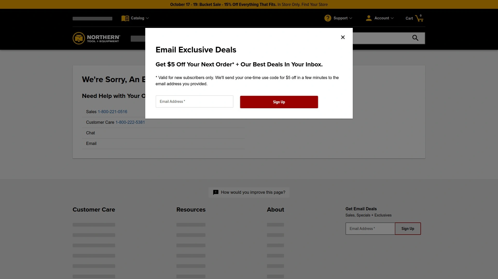

- **Product Focus:** They are a leading supplier of generators, pressure washers, welders, and automotive repair equipment.
- **Who It's For:** Farmers, mechanics, contractors, and anyone who needs robust, professional-grade machinery.

## **[Snap-on](https://www.snapon.com)**
Snap-on represents the pinnacle of quality and performance in the automotive tool world, favored by professional mechanics who demand the absolute best.

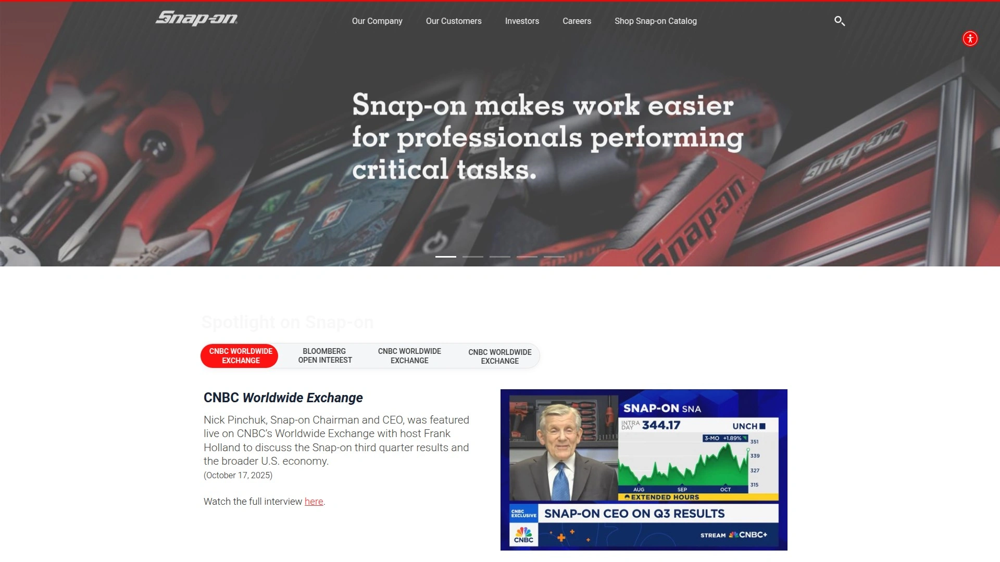

- **Reputation:** Known for its legendary durability, precision engineering, and lifetime warranty on hand tools. Snap-on tools are an investment.
- **How to Buy:** Primarily sold through a network of franchisees who visit automotive shops directly in their iconic trucks, but the website is a comprehensive catalog of their offerings.

## **[Klein Tools](https://www.kleintools.com)**
For over 160 years, Klein Tools has been the go-to brand for professional electricians in North America.

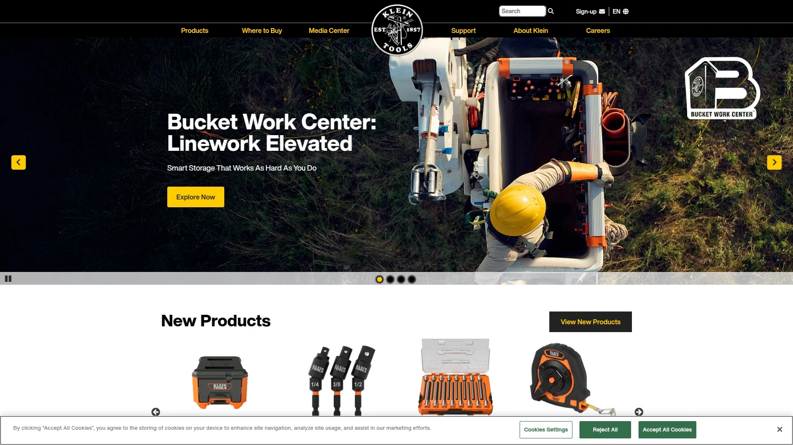

- **Specialization:** They are masters of their craft, producing high-quality, durable hand tools specifically designed for electrical work, such as wire strippers, pliers, and insulated screwdrivers.
- **Target Audience:** If you are an electrician, this brand is an industry standard.

## **[Knipex](https://www.knipex.com)**
A German brand renowned for making the highest quality pliers in the world. Knipex is a name revered by tradespeople who value precision and longevity.

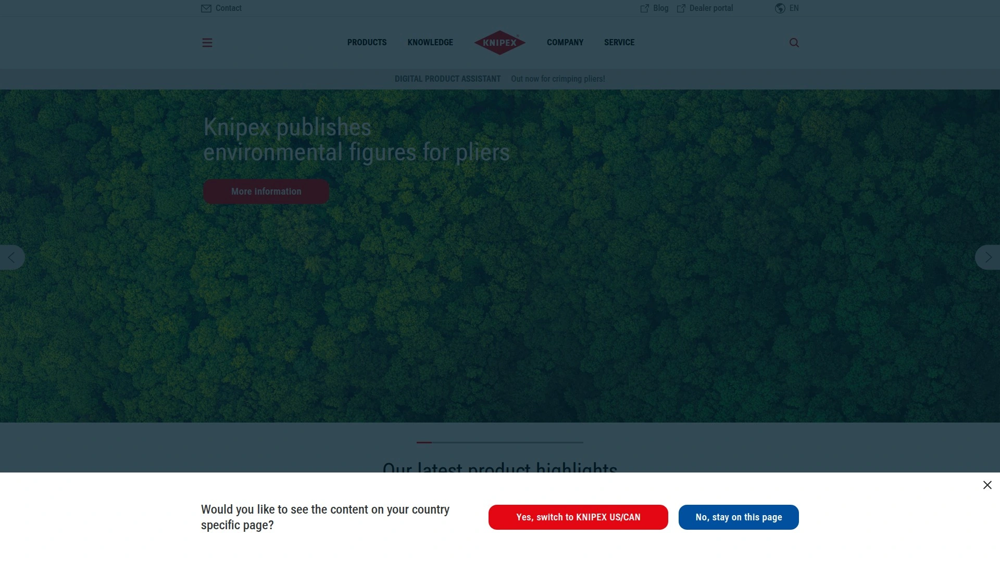

- **Signature Products:** Famous for their Pliers Wrench and Cobra Pliers, which offer innovative designs and superior gripping power.
- **Why It's on the List:** For anyone who uses pliers regularly, investing in Knipex is often seen as a significant upgrade in efficiency and comfort.

## **[Wera](https://www.wera.de/en/)**
Wera is a German tool manufacturer known for its unconventional approach to design and its obsession with creating high-quality screwdriving tools.

- **Innovation:** Known for their ergonomic Kraftform handles, "anti-cam-out" Zyklop ratchets, and colorful, easy-to-find hex keys (Allen wrenches). They call themselves "Tool Rebels."
- **Best For:** Technicians, mechanics, and assemblers who appreciate thoughtful design that makes their job easier and more comfortable.

## **[GearWrench](https://www.gearwrench.com)**
GearWrench pioneered the five-degree ratcheting wrench and has since become a go-to brand for mechanics and DIYers seeking professional-grade features without the premium price tag.

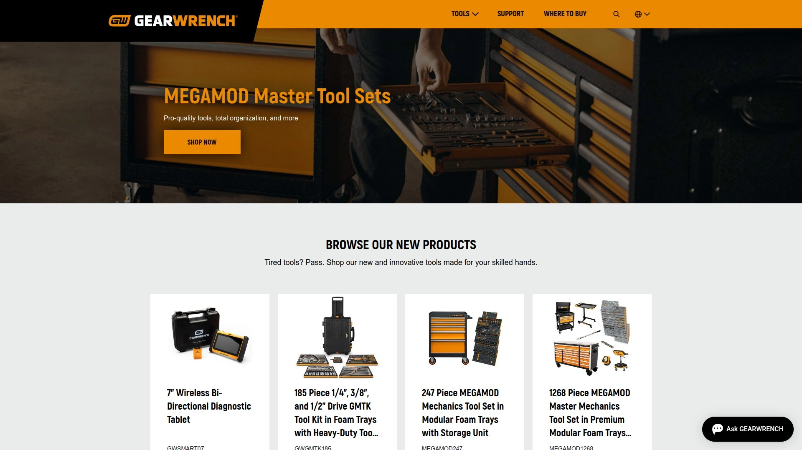

- **Core Offering:** Best known for its extensive and affordable mechanics' tool sets. Their ratcheting wrenches are a game-changer for working in tight spaces.
- **Value:** Delivers an excellent balance of performance and cost, making it a smart choice for those building out their first serious tool collection.

## **[Festool](https://www.festoolusa.com)**
Festool is a high-end German brand that creates integrated systems of power tools, primarily for woodworking, painting, and remodeling.

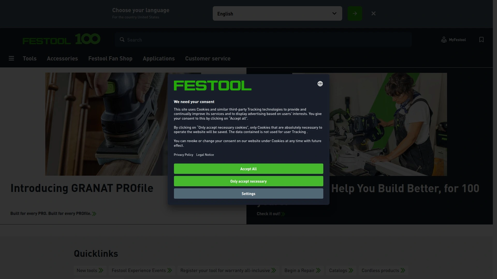

- **System Approach:** Famous for its unparalleled dust extraction capabilities, which keep workspaces incredibly clean. Their tools, like track saws and sanders, are designed to work together flawlessly.
- **Target User:** Professional woodworkers and remodelers who prioritize precision, efficiency, and a clean work environment. It's a premium system with a price to match.

## **[Lee Valley Tools](https://www.leevalley.com)**
A Canadian retailer beloved by woodworkers and gardeners for its high-quality, often unique tools, hardware, and supplies.

- **Reputation:** Lee Valley is known for its excellent customer service and its own Veritas line of woodworking planes and tools, which are considered among the best in the world.
- **Why It's Special:** It's a source for thoughtfully designed, hard-to-find tools that solve specific problems for craftspeople.

## **[Rockler](https://www.rockler.com)**
For over 65 years, Rockler has been a premier destination for woodworkers, offering a wide range of tools, hardware, project plans, and expert advice.

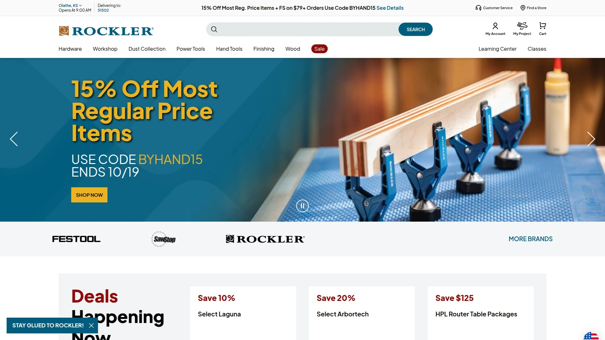

- **Niche Focus:** It's a one-stop-shop for everything related to woodworking. They sell major tool brands and also develop their own innovative jigs and accessories.
- **Community Hub:** Beyond just a store, Rockler fosters a community with in-store classes and a wealth of online resources for woodworkers of all skill levels.

***

### **FAQ**

**How do I choose the right tool brand for my needs?**
For occasional DIY tasks, budget-friendly brands offer great value. For professional or heavy daily use, investing in high-end, durable brands is often more cost-effective in the long run.

**Is it better to buy tools online or in-store?**
Online stores often provide a wider selection and competitive pricing, while physical stores allow you to handle the tools before buying and offer immediate availability. Many of the best platforms combine both.

**What's the best way to start building a tool collection?**
Begin with a quality basic hand tool kit (hammer, screwdrivers, pliers, tape measure) and then buy specific power tools as your project needs dictate. A versatile cordless drill is often the first power tool people buy.

***

### **Conclusion**

With this map of the top tool websites, you're now equipped to find the right gear for any project, from a simple repair to a full-scale renovation. Whether you need professional-grade machinery or just a reliable drill for weekend tasks, the perfect platform is out there. For projects that require specialized equipment without the professional price tag, **[VEVOR](https://www.vevor.com)** is often the perfect place to start your search.
